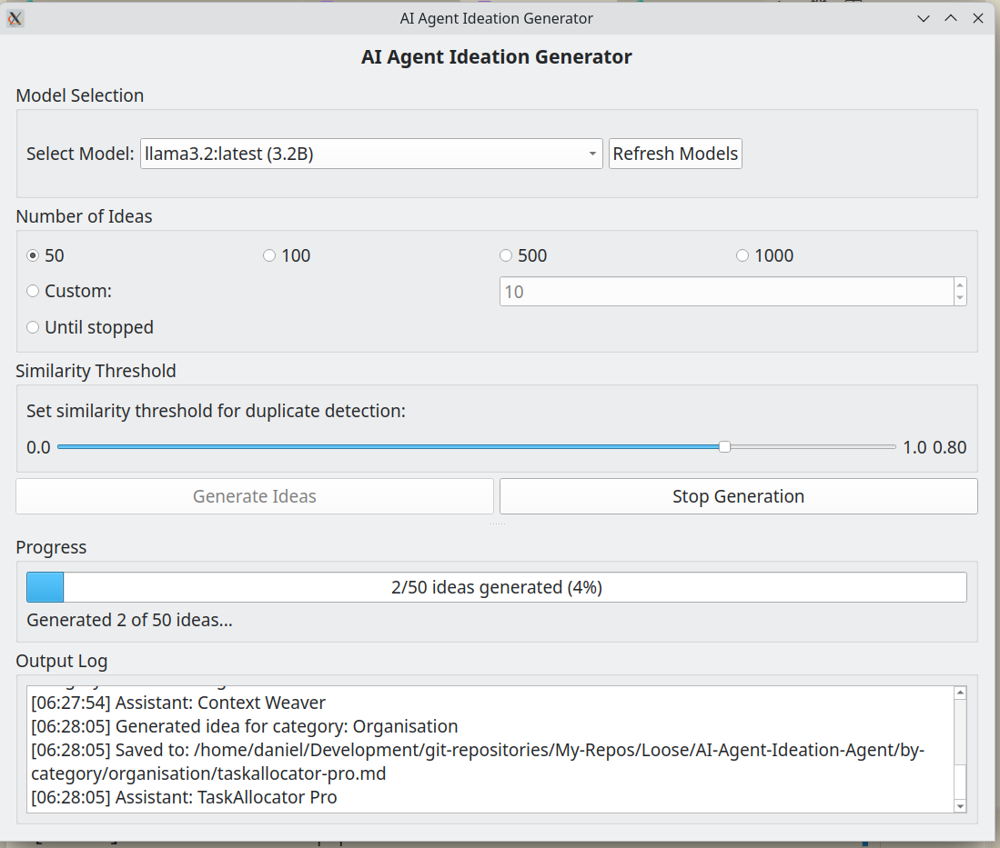
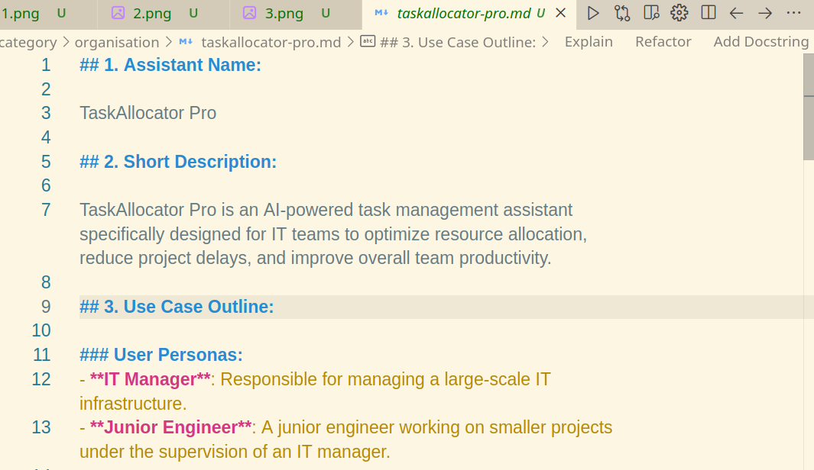

# AI Assistant Ideation Generator


## Experiment in AI-Powered Ideation

This project is an experiment in using AI for ideation - one of the most powerful applications of large language models. The AI Assistant Ideation Generator helps you rapidly generate hundreds or even thousands of AI assistant ideas across various categories.



## Core Concept

The power of this tool lies in its ability to generate a massive number of ideas quickly. While not every idea will be perfect, the sheer volume allows you to:

1. **Explore a vast idea space** that would be impossible to cover manually
2. **Discover unexpected niches** and specialized use cases
3. **Overcome creative blocks** by providing novel starting points
4. **Identify patterns** across different categories of AI assistants

The tool uses local LLMs through Ollama to generate highly specific, niche AI assistant ideas based on categories you define. Each idea is saved as a markdown file with a structured format.

## Primary Interface: GUI Application

The graphical interface is the recommended way to use this tool, offering:



* **Model Selection**: Choose from any model available in your Ollama installation
* **Flexible Generation Options**:
  - Generate preset quantities (50, 100, 500, 1000 ideas)
  - Set a custom number of ideas to generate
  - Run in "Until stopped" mode for unlimited generation
* **Similarity Detection**: Adjustable threshold to avoid duplicate ideas
* **Real-time Progress Tracking**: Monitor generation progress and view logs
* **Start/Stop Control**: Pause generation at any time

## Setup

1. Clone this repository:
   ```
   git clone https://github.com/yourusername/AI-Agent-Ideation-Agent.git
   cd AI-Agent-Ideation-Agent
   ```

2. Make sure Ollama is installed and running:
   ```
   # Check if Ollama is running
   curl http://localhost:11434/api/tags
   ```

3. Install dependencies:
   ```
   pip install -r requirements.txt
   ```

4. Launch the GUI:
   ```
   python gui_generate_agent_ideas.py
   ```

## How It Works

1. **Category Selection**: The system randomly selects from predefined categories in `categories.txt`
2. **Idea Generation**: Using a template, the selected Ollama model creates a detailed AI assistant concept
3. **Similarity Checking**: Each new idea is compared against existing ones to avoid duplicates
4. **Organization**: Ideas are saved in category-specific folders for easy browsing

## Customization

* **Categories**: Edit `categories.txt` to define your own categories
* **Template**: Modify `templates/template.md` to change the structure of generated ideas
* **Similarity Threshold**: Adjust in the GUI to control how strictly duplicates are filtered

## Generating Large Batches

The tool is optimized for generating large numbers of ideas (500-1000+) in a single session. The GUI provides real-time feedback during this process and handles error recovery automatically.

For the best results:
1. Choose a capable model (larger models tend to produce more creative and diverse ideas)
2. Set the similarity threshold based on your needs (lower for more variety, higher for stricter filtering)
3. Use the "Until stopped" option to generate ideas continuously until you find enough that inspire you

## CLI Alternative

While the GUI is recommended, a command-line interface is also available:

```bash
# Generate 100 ideas
python generate_agent_ideas.py 100 --model llama3.2

# Generate 500 ideas with a different model
python generate_agent_ideas.py 500 --model mistral
```

## Future Enhancements

* Database integration for better idea management
* Cloud LLM support
* Idea rating and filtering system
* Export options for sharing idea collections

## Contributing

Contributions are welcome! This is an experiment in AI-powered ideation, and there are many ways to enhance and extend the concept.

## License

[Insert your license information here]